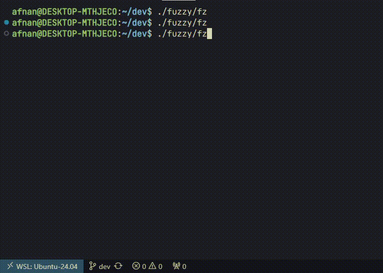

### Fuzzy Finder




The program uses the concept of fuzzy search to search through the file system.

NOTE: Levenshtein has been removed 
Contains two algorithms, namely 'Levenshtein Distance' and 'N-Grams' (Modified for this use case)
Levenshtein was too slow on large number of files so it was dropped, and the more performant N-Gram algorithm was used
Of course, further optimizations can definitely be made, but this code is from the time when I didn't know much Go.

From my personal testing on a i5 1135G7, I was able to search to 200K to 300K files quite accurately. You wont find any slowdowns in a typical project only those files are indexed where you call the exec.

Usage: 
- type fz in your terminal to run
```fz -t vim``` 
- the ```-t``` flag refers to tool with which you want to open the file e.g code, zed, nvim, nano etc.
- pressing tab will select files to open
- pressing enter will open those files, and close the finder

The algorithm is a bit slower than what you'll find out there(such as fzf), but this still provides accurate results even if you misspell.

If you want to run it, you'll have to build it using the Go Compiler according to your OS. Working on executables for windows, mac and linux.
